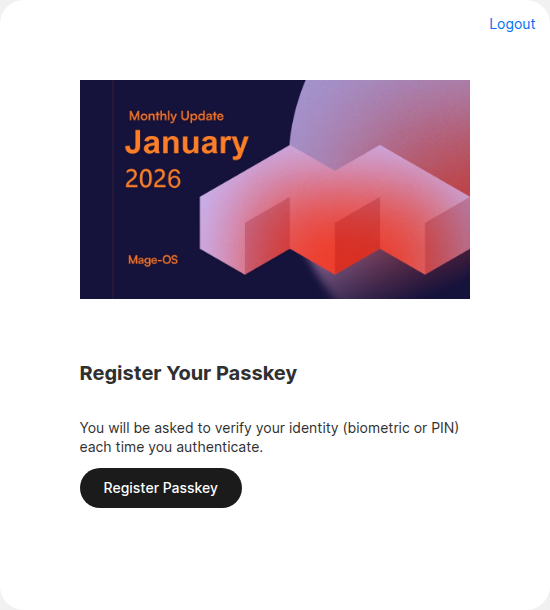

# Admin two-factor authentication

The module adds **Passkey** as a provider for Magento's built-in admin two-factor authentication (Magento_TwoFactorAuth). Admins sign in with their password, then confirm with a passkey instead of a code from an app.

This is separate from customer passkeys. It works even when **Enable Passkey Authentication** is off.

## Turn it on

Go to **Stores > Configuration > Security > 2FA** and add **Passkey** to **Providers to use**.

From the command line, set the full list of providers you want. For example:

```bash
bin/magento config:set twofactorauth/general/force_providers google,passkey
```

If more than one provider is allowed, each admin can pick which one to set up.

## Register an admin passkey

1. Sign in to the admin with your username and password.
2. On the two-factor setup screen, choose **Passkey** if more than one provider is offered.
3. Click **Register Passkey** and follow the browser prompt.



After that, each admin sign-in asks for the passkey.

Things to know:

- Each admin user has **one** passkey. To replace it, reset it first (see below), then register again.
- Admin passkeys always require user verification: a fingerprint, face, device PIN, or security key PIN.
- Security keys, built-in authenticators such as Windows Hello or Touch ID, and password managers all work.
- The passkey is tied to the admin URL's domain. If the admin URL moves to another domain, the passkey stops working and the admin sees a message saying the domain has changed. Reset their passkey so they can register a new one.

## Reset an admin's passkey

**One user, in the admin:** open **System > Permissions > All Users**, edit the user, and reset the Passkey provider in the two-factor section.

**One user, from the command line:**

```bash
bin/magento security:tfa:reset <username> passkey
```

**All users:**

```bash
bin/magento security:tfa:passkey:reset-all
```

This lists the affected admins and asks for confirmation. Add `--force` to skip the question, for example in a script.

After a reset, the admin registers a new passkey at their next sign-in.

## Lockout recovery

If an admin has lost their passkey and no other admin can sign in, run `security:tfa:reset` for that user from the server. There is no way around the second factor from the browser.

## Logging

Successful registrations, failed registrations, and failed sign-ins are reported through Magento_TwoFactorAuth's alert mechanism. Details of failed checks are written to `var/log/system.log`.
