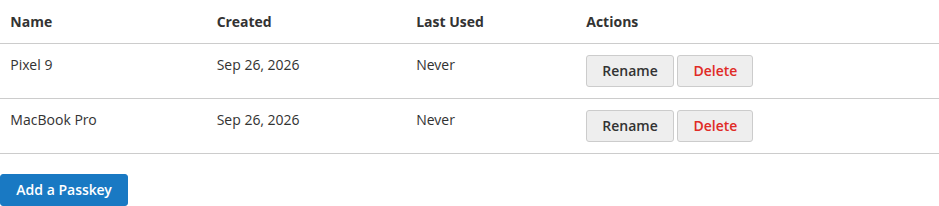
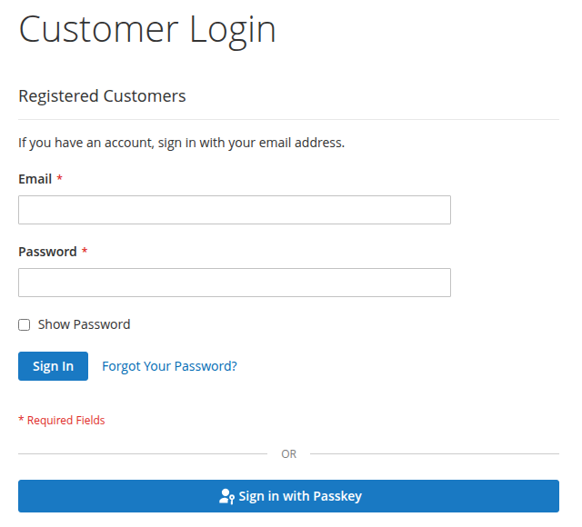
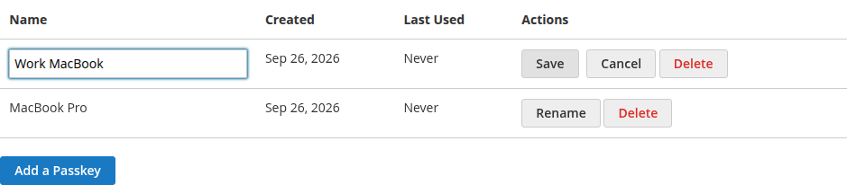
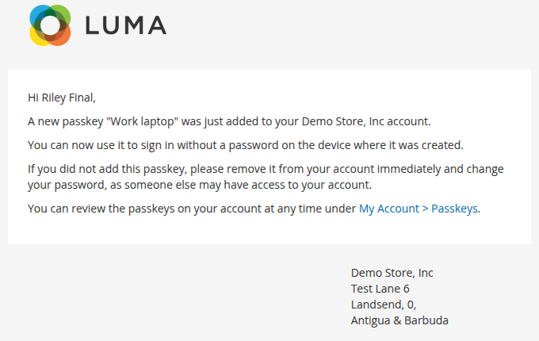

# Customer guide

This page is written for shoppers. Store owners can copy it into a CMS help page and adjust the wording.

## What is a passkey?

A passkey lets you sign in without typing your password. You confirm it's you the same way you unlock your phone or computer: fingerprint, face, device PIN, or a security key.

Your passkey is stored by your device or password manager (for example iCloud Keychain, Google Password Manager, Windows Hello, or 1Password). Our store never sees your fingerprint or face data. It only stores a public key that can't be used to sign in on its own.

Passkeys only work on our website's address, so they can't be used on a fake copy of our site.

## What you need

- A recent version of Chrome, Safari, Edge, or Firefox.
- A device with a screen lock (fingerprint, face, or PIN), a password manager that supports passkeys, or a security key.

## Add a passkey

1. Sign in with your email and password.
2. Go to **My Account > Passkeys**.
3. Click **Add a Passkey**.
4. Enter a name you'll recognize, such as "Work laptop". We suggest one based on your browser, like "Chrome on Windows".
5. Follow your browser's prompt to create the passkey.

We'll send you an email to confirm the passkey was added.

You can also start from the **Sign in faster with a passkey** banner that may appear on your account pages. Click **Set up** to go to the Passkeys page, or **Not now** to hide the banner.

You can have up to 10 passkeys, for example one per device.

## Sign in with a passkey

On the sign-in page, either:

- Click the email field. If your browser has a passkey for our site, it appears in the suggestions. Pick it and confirm.
- Or click **Sign in with Passkey** and follow your browser's prompt. If you type your email first, your browser only offers passkeys for that account.

At checkout, the email field also offers your saved passkey.

Your password still works. Adding a passkey doesn't turn it off.

## Use a passkey from your phone on another computer

If your passkey is on your phone and you're signing in on a computer, choose the option to use a phone or another device in the browser prompt. Scan the QR code with your phone and confirm there.

## Rename a passkey

Go to **My Account > Passkeys**, click **Rename**, enter a new name, and click **Save**. Names can be up to 255 characters and can't contain `<`, `>`, or `&`.

## Delete a passkey

Go to **My Account > Passkeys** and click **Delete** next to the passkey. We'll send you an email to confirm.

Deleting it here stops it from working on our site. It may still be listed in your device's password manager. You can delete it there too.

## If you lose a device

Sign in with your password or another passkey, go to **My Account > Passkeys**, and delete the passkey for the lost device. The **Last Used** column helps you tell them apart.

If you can't sign in, reset your password with **Forgot Your Password?**, or contact us.

## Emails about passkeys

We email you when a passkey is added to or removed from your account.

If you didn't make the change, sign in, remove any passkey you don't recognize, change your password, and contact us.

## Messages you might see

| Message | What to do |
|---|---|
| Passkey sign-in was cancelled, or no passkey for this account was found on this device. | You closed the prompt, or this device has no passkey for this account. Try another device, or sign in with your password. |
| This device already has a passkey for your account. | You already added a passkey on this device. Sign in with it instead. |
| Passkeys require a secure (HTTPS) connection. | Make sure the address bar shows `https://`. |
| Your browser does not support passkeys. | Update your browser, or use a different one. |
| Too many passkey requests / Too many failed passkey attempts. Please try again later. | Wait 15 minutes and try again, or sign in with your password. |
| Maximum number of passkeys (10) reached. | Delete a passkey you no longer use, then add the new one. |
