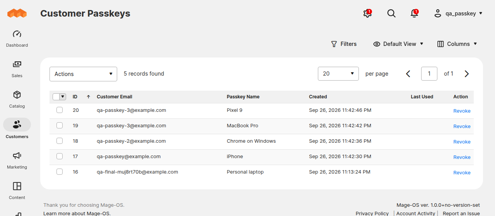

# Store admin guide

This guide covers what merchants and support staff do with customer passkeys day to day. For setup, see [Installation](installation.md) and [Configuration](configuration.md).

## The Customer Passkeys grid

Go to **Customers > Customer Passkeys**.

Each row is one passkey. The columns are:

| Column | Meaning |
|---|---|
| ID | Internal passkey ID |
| Customer Email, First Name, Last Name | The account the passkey belongs to |
| Passkey Name | The name the customer gave it. Empty if they skipped naming it. |
| Transports | How the authenticator connects, as reported by the browser: `internal` (built into the device), `hybrid` (phone via QR code), `usb`, `nfc`, `ble` |
| Signature Counter | A counter some authenticators increase on each use. Many passkeys always report 0. That is normal. |
| Created, Last Used | Dates in the admin's timezone. Last Used is empty until the first passkey sign-in. |

You can filter, sort, and choose columns like any other admin grid.

The grid only shows metadata. It never shows keys or anything that could be used to sign in.

## Revoke passkeys

- **One passkey:** click **Revoke** in its row.
- **Several:** select rows, then choose **Actions > Revoke**.

A revoked passkey stops working at once. The customer gets the "passkey removed" email, if emails are on. The customer can still sign in with their password and can add a new passkey.

Revoking does not remove the passkey from the customer's device. It still appears in their password manager but no longer works on your store.

## Admin permissions

Under **System > Permissions > User Roles > Role Resources**:

| Resource | Allows |
|---|---|
| Customers > Customer Passkeys | Viewing the grid |
| Customers > Customer Passkeys > Revoke Customer Passkeys | Revoking passkeys |

Changing the settings uses the normal **Stores > Configuration** permission for the Customer Configuration section.

## Notification emails

When emails are on, the customer is emailed each time a passkey is added or removed. That includes removals by the customer, through the API, and by an admin.

To change the wording, go to **Marketing > Email Templates > Add New Template**, load **Passkey Added to Account** or **Passkey Removed from Account**, edit, save, and then pick your template in the passkey settings.

Available variables: `customer_name`, `passkey_name`, and `store_name`.

Emails use the customer's store view for language and design. For accounts created in the admin with no store view, the website's default store view is used.

A failed email never blocks the passkey change. Failures are logged to `var/log/exception.log`.

## Common support cases

**"I lost my phone."**
The customer can sign in with their password and delete the passkey under **My Account > Passkeys**. If they can't sign in, have them reset their password, or revoke their passkeys for them in the grid.

**"I got an email about a passkey I didn't add."**
Treat it as a possible account takeover. Revoke the unknown passkey in the grid. Have the customer reset their password. Check the customer's recent orders and address changes.

**"The passkey button doesn't work."**
Check that the customer is on `https://` at your normal store address. Passkeys don't work on a different domain, including `www` vs. no `www`. See [Troubleshooting](troubleshooting.md).

**"My passkey stopped working after you changed your website address."**
Expected. Passkeys are tied to the domain. The customer signs in with their password and adds a new passkey. You can bulk-revoke the old passkeys in the grid. They no longer work anyway.

## Deleting a customer

Deleting a customer account also deletes their passkeys. No "passkey removed" email is sent in that case.
